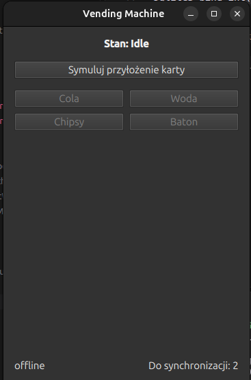

# Vending Machine

The core logic of a vending machine (C++20) with a minimal QML interface. The machine must operate correctly despite frequent network outages and must never lose a transaction, even if the process crashes while the product is being physically dispensed.



## Structure

- `Core/`: domain logic (state machine, VendingManager, SQLite transaction journal, synchronization worker), with no dependency on Qt.
- `gui/`: QML interface and the class connecting it to Core (VendingMachineBridge)
- `tests/`: GTest tests and fake hardware/database/network implementations, used both in tests and in the GUI to simulate card insertion and product dispensing without real hardware.

The rationale behind the design decisions (code separation, synchronization idempotency, handling power/process failure during dispensing, and unfinished work) is described in:
[`DECISIONS.md`](DECISIONS.md).

## Installing Dependencies

```bash
sudo apt install libgtest-dev
sudo apt install libsqlite3-dev
sudo apt install qtcreator qt6-base-dev qt6-declarative-dev \
    qml6-module-qtquick qml6-module-qtquick-controls \
    qml6-module-qtquick-window qml6-module-qtqml-workerscript \
    qml6-module-qtquick-layouts qml6-module-qtquick-templates \
    qml6-module-qtquick-nativestyle qt6-tools-dev
```

## Building

```bash
cmake -S . -B build
cmake --build build
```

## Running Tests

```bash
./build/tests
```

## Running GUI

```bash
./build/Vending_Machine
```

## Backend / serwer

Instead of a real REST server, the network layer (ITransport) only has a FakeTransport implementation. It simulates random connection failures (by default, a 70% chance of a send failure) and keeps the UUIDs of successfully sent transactions in memory.

This choice is due to the available development time and is explicitly allowed by the task specification as an alternative to setting up a real server.

## Moje notatki (SQLite)
To jest dla mnie jakbym se czegoś zapomniał

SQLite ma dwa niezależne mechanizmy indeksowania, oba liczone inaczej — łatwo to pomylić
przy pisaniu kolejnych zapytań.

Parametry w `bind` — indeksowane **od 1**:
```cpp
// UPDATE transactions SET status = ? WHERE status = ?
sqlite3_bind_int(stmt, 1, STATUS_UNKNOWN);
sqlite3_bind_int(stmt, 2, STATUS_PENDING);
```

Kolumny w wyniku zapytania (`SELECT`) — indeksowane **od 0**:
```cpp
t.uuid = sqlite3_column_text(stmt, 0);
```